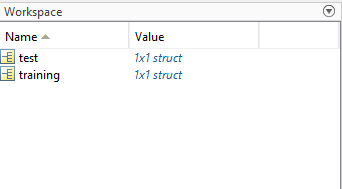
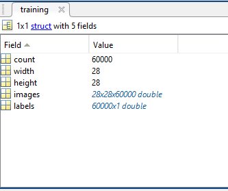
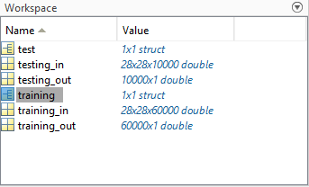
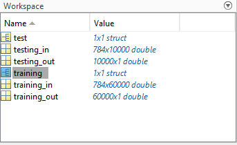
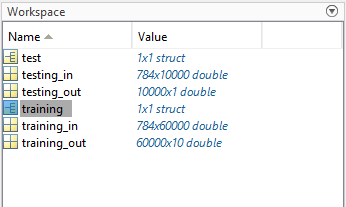
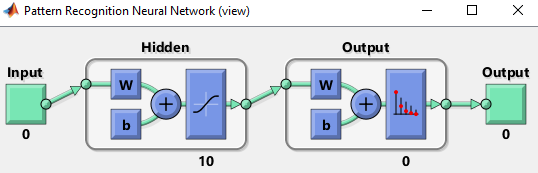
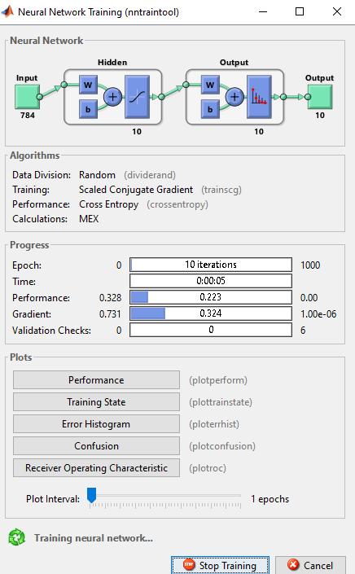
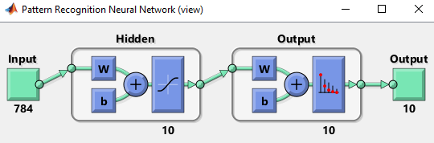

# Red Neuronal MLP
  

A continuación se programa el entrenamiento y validación de una red neuronal perceptrón multicapa para el reconocimiento de imágenes de números escritos a mano-alzada. El conjunto de datos es altamente conocido. se denomina MNIST y contiene 60000 imágenes de entrenamiento y 10000 imágenes de validación.

El conjunto se puede descargar en formato .mat del siguiente [enlace](https://lucidar.me/en/matlab/files/mnist.mat)

```matlab:Code
load('mnist.mat')
```

Al realizar la carga de los datos se obtienen las variables training y test



Internamente estas variables tipo struct contienen:



La variable images contiene 60000 imágees de 28x28 pixeles y la variable labels contiene las 60000 etiquetas que corresponde a cada número. Por ejemplo, si la imagen es de un 5, entonces la etiqueta es "5".

# Preprocesamiento de imágenes

A continuación se extraen las imágenes en variables

```matlab:Code
training_in = training.images;
training_out = training.labels;
testing_in = test.images;
testing_out = test.labels;
```



## Entradas

Las entradas deben redimensionarse, para que cada imagen quede almacenada en un solo vector y que se pueda alimentar las entradas de la red neuronal. De origen cada imagen tiene un tamaño de 28x28 por lo cual se requiere que sea un conjunto de 784x60000.

```matlab:Code
training_in = reshape(training_in,[784,60000]);
testing_in = reshape(testing_in,[784,10000]);
```



## Salidas

Las salidas de origen están en un formato numérico entero, sin embargo la idea es tener 10 salidas donde solamente se activara la salida que se reconozca y las otras en cero. Para esto primero debemos declarar las salidas del tipo categórico (clases) y luego codificarlas mediante one hot encoding.

```matlab:Code
training_out = categorical(training_out);
training_out = onehotencode(training_out,2);
```



# Construcción del modelo

A continuación se crea una red neuronal con una sola capa oculta y una capa de salida. En este caso se agregarán 5 neuronas a la capa oculta. Las otras capas asignan automáticamente las entradas y salidas  apartir del conjunto de datos:

```matlab:Code
net = patternnet(10);
view(net)
```

Se puede agregar el tipo de algoritmo de optimización que por defecto es gradiente descendente y el tipo de función de pérdidas que por defecto es cross-entropy (muy usada en tareas de clasificación)

Se despliega una ventana que ilustra la red neuronal creada, allí se ve 10 neuronas en la capa oculta. En la capa de salida muestra 0, ya que aún no se ha asignado salidas



# Entrenamiento

Ahora se procede al entrenamiento

```matlab:Code
net = train(net,training_in,training_out');
view(net)
```

Al iniciarse el entrenamiento se despliega esta ventana:



En ella se puede observar el avance del entrenamiento. Al finalizar el entrenamiento la red está completa y se puede ver así:



# Validación

Por último se puede validar el resultado con el conjunto de datos de validación

```matlab:Code
y = net(testing_in);
y(:,1:10)
```

```text:Output
ans = 10x10    
    0.0001    0.0893    0.0000    0.9987    0.0000    0.0000    0.0000    0.0000    0.0001    0.0000
    0.0000    0.0003    0.9870    0.0000    0.0002    0.9913    0.0000    0.0074    0.0970    0.0000
    0.0000    0.8536    0.0035    0.0004    0.0004    0.0016    0.0000    0.0001    0.0006    0.0000
    0.0090    0.0110    0.0029    0.0000    0.0000    0.0027    0.0000    0.0127    0.0001    0.0000
    0.0000    0.0000    0.0001    0.0000    0.9963    0.0000    0.9907    0.0007    0.7423    0.0231
    0.0001    0.0449    0.0018    0.0008    0.0000    0.0008    0.0002    0.0011    0.0232    0.0001
    0.0000    0.0005    0.0019    0.0001    0.0008    0.0000    0.0000    0.0001    0.1174    0.0000
    0.9908    0.0000    0.0014    0.0000    0.0000    0.0014    0.0005    0.0003    0.0000    0.0019
    0.0000    0.0004    0.0013    0.0000    0.0001    0.0018    0.0016    0.0566    0.0131    0.0059
    0.0000    0.0000    0.0000    0.0000    0.0022    0.0003    0.0070    0.9211    0.0062    0.9689

```

Arriba se puede ver el resultado para la predicción de las 10 primeras imágenes de validación. Ahora se decodificará nuevamente para expresar el número al que corresponde y se comparará con el conjunto testing_out

```matlab:Code
classes = vec2ind(y(:,1:10))
```

```text:Output
classes = 1x10    
     8     3     2     1     5     2     5    10     5    10

```

```matlab:Code
testing_out(1:10)'
```

```text:Output
ans = 1x10    
     7     2     1     0     4     1     4     9     5     9

```

Se observa que probablemente el sistema no está entrenado adecuadamente y es necesario hacer ajustes en la cantidad de neuronas, epochs y función de activación
